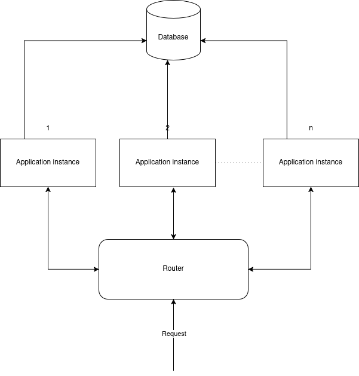

# CodeReviewAI

## Description
This application downloads repositories using the GitHub API and analyzes them using ChatGPT.

## Requirements
- Python >= 3.12
- Poetry
- Docker or Redis

## Instructions
1. Clone this repository.

2. Create a `.env` file in the app root directory, similar to `example.env`, and populate it with all required variables.

3. To run outside Docker (requires a Redis instance for caching data):  
   If you do not have a Redis instance, run the following command from the app root:
    ```bash
    docker-compose -f deploy/dev/docker-compose.yaml up -d
    ```

4. To run inside docker (from app root):
    ```bash
    docker-compose -f deploy/prod/docker-compose.yaml up -d
    ```

## Notice

### This is a prototype and may not handle a large number of requests.

Its performance depends on the OpenAI API and GitHub API rate limits.  
For repositories with 100+ files, a higher usage tier for APIs (or multiple keys from different accounts) is required.
It also relies on the server and Redis (which uses RAM for storing data). 
For better scalability, consider using a database (e.g., PostgreSQL) 
to store cached data and repository content (optional).

Possible Schema for Scaling



